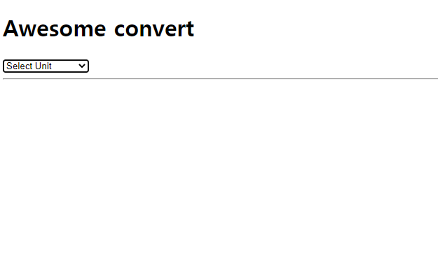
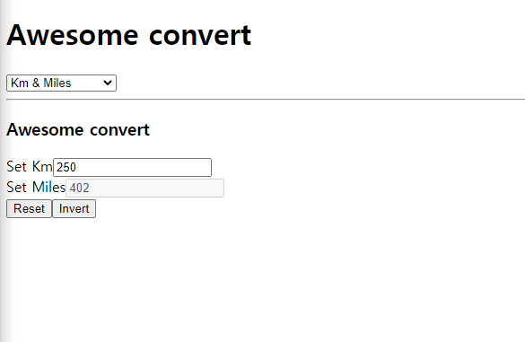
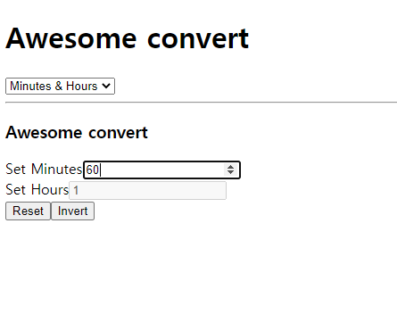

# 🙌Study React

### 👀index.html 내에서 공부가 진행됩니다! commit을 따라오시면 과정을 보실 수 있습니다!

| study list |    title    |                                                      Write                                                       |
| :--------: | :---------: | :--------------------------------------------------------------------------------------------------------------: |
|   React    | State / JSX | <a href="https://github.com/Y00NMIN/Nomad-React-MovieWeb/commit/f1044ca55335afffdd26e2d690c0413f5616f9d1">📄</a> |
|   React    |    State    | <a href="https://github.com/Y00NMIN/Nomad-React-MovieWeb/commit/7dce3b32f6f71d02bed875ec2b358351fe93afc1">📄</a> |
|   React    |    Prop     |                                                <a href="">📄</a>                                                 |

#### 🏆🏆Create Convert (convert hours to minutes / kil)

  
Convert Selector page
  
KM & Miles Convert
  
Hours & Minutes Convert
